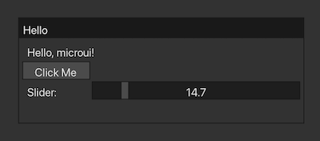

# vmicroui



V-lang port of [microui](https://github.com/rxi/microui)

## Usage

[demo.v](https://github.com/funatsufumiya/vmicroui/blob/main/demo/demo.v)

```bash
$ git clone https://github.com/funatsufumiya/vmicroui ~/.vmodules/microui
$ v run ~/.vmodules/microui/demo/demo.v
```

### debug

```bash
$ v -g -cc clang -keepc demo/demo.v
# and debug demo/demo(.exe)
```

----

Original README: [README_ORIG.md](README_ORIG.md)
